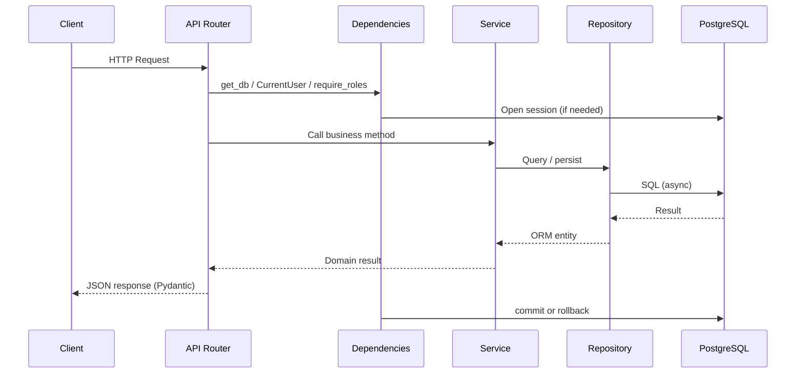
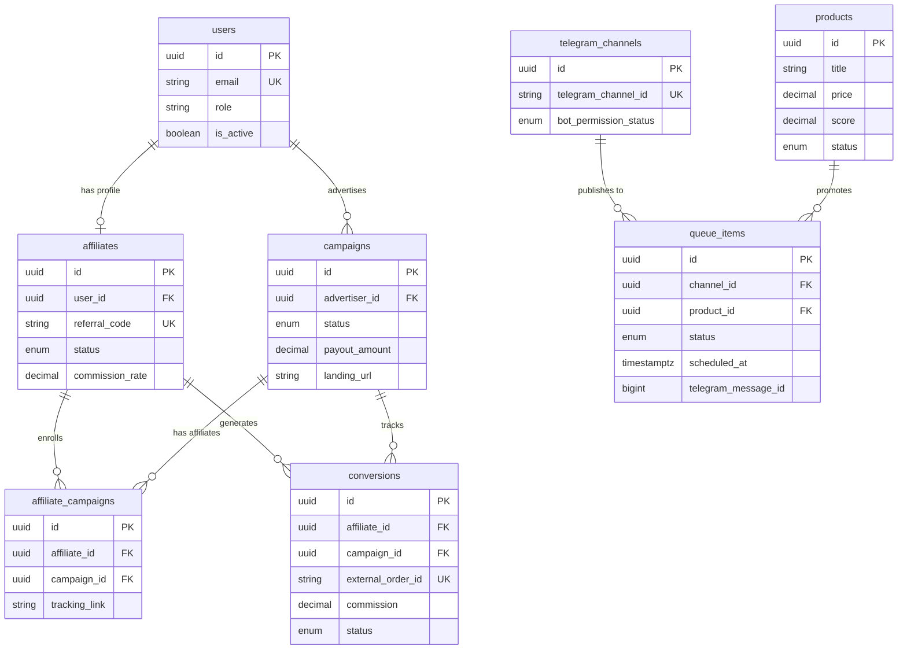
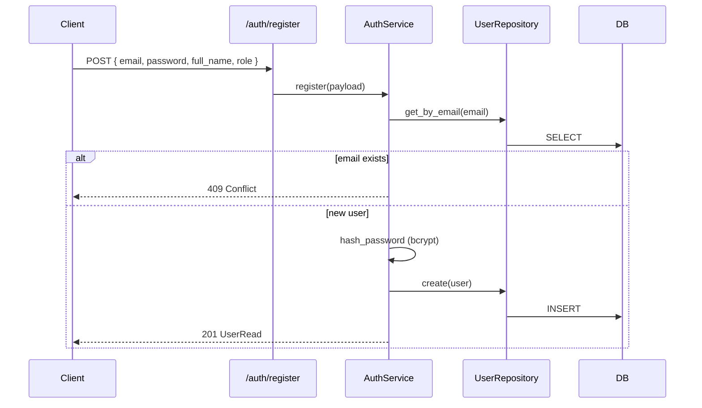
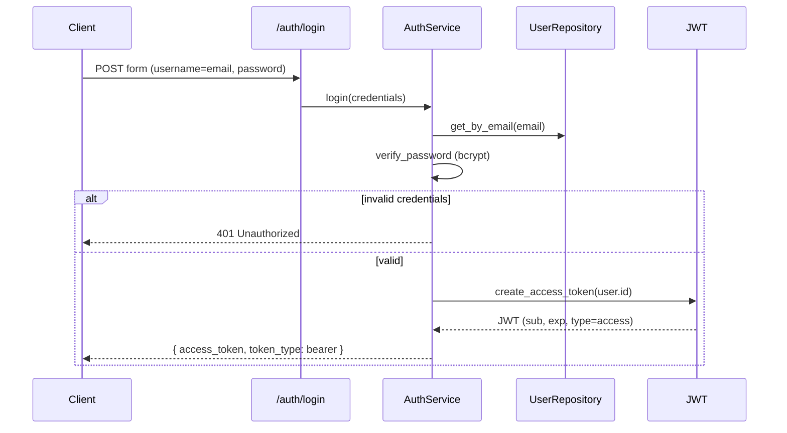
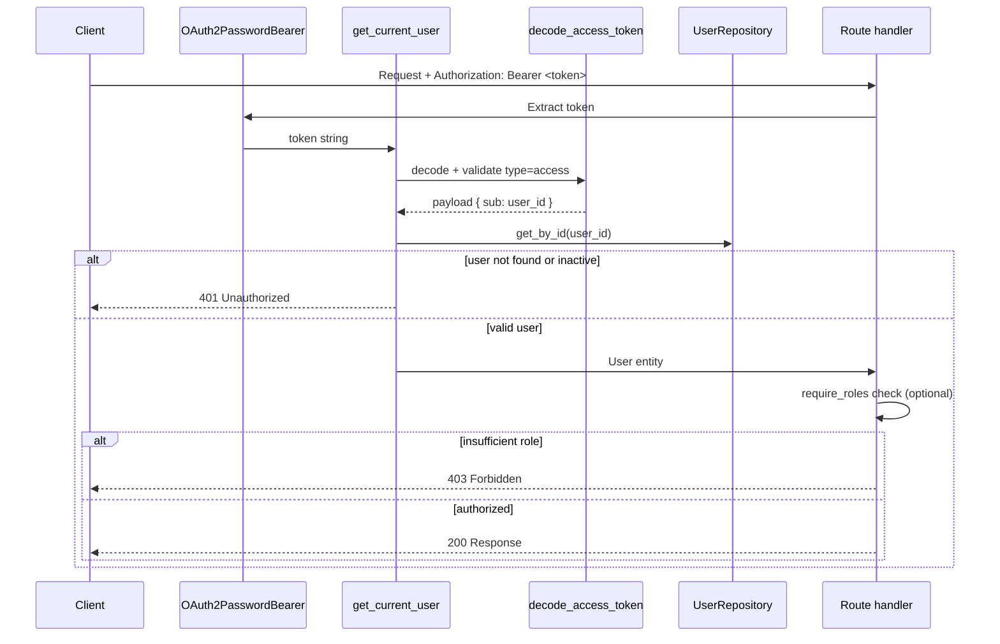
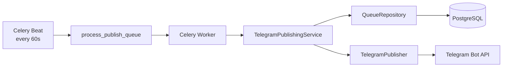

# Architecture

This document describes how the **Affiliate Platform API** is structured, how data flows through the system, and where the project is headed next.

---

## Overview

The application is a **layered, async FastAPI backend** backed by PostgreSQL. External systems (Telegram, OpenAI, Gemini, AliExpress) are accessed through dedicated client modules. Long-running and scheduled work (Telegram publishing) runs in **Celery workers** via Redis.

```
┌──────────────────────────────────────────────────────────────────┐
│                         HTTP Clients                             │
└─────────────────────────────┬────────────────────────────────────┘
                              │
                              ▼
┌──────────────────────────────────────────────────────────────────┐
│  API Layer          app/api/v1/*  +  app/auth/router.py          │
│  • Route handlers    • Pydantic validation    • Auth guards        │
└─────────────────────────────┬────────────────────────────────────┘
                              │
                              ▼
┌──────────────────────────────────────────────────────────────────┐
│  Service Layer      app/services/*                               │
│  • Business rules    • Orchestration    • Domain exceptions        │
└──────────────┬──────────────────────────────┬────────────────────┘
               │                              │
               ▼                              ▼
┌──────────────────────────┐   ┌───────────────────────────────────┐
│  Repository Layer        │   │  Integration Clients              │
│  app/repositories/*      │   │  app/ai/  app/telegram/           │
│  app/auth/repository.py  │   │  app/aliexpress/                  │
└──────────────┬───────────┘   └───────────────────────────────────┘
               │
               ▼
┌──────────────────────────────────────────────────────────────────┐
│  ORM Models         app/models/*  +  app/auth/models.py          │
│  SQLAlchemy 2.0 async · PostgreSQL                               │
└──────────────────────────────────────────────────────────────────┘

        ┌──────────────── Celery Worker ────────────────┐
        │  app/worker/  →  services  →  repositories  │
        └──────────────────── Redis ────────────────────┘
```

---

## FastAPI Structure

### Application entry point

`app/main.py` bootstraps the FastAPI application:

- Loads settings from `app/core/config.py` (Pydantic Settings + `.env`)
- Registers CORS middleware
- Mounts the v1 API router at `API_V1_PREFIX` (default `/api/v1`)
- Exposes `/health` and OpenAPI docs at `/docs`

### Router organization

All versioned routes live under `app/api/v1/` and are aggregated in `app/api/v1/router.py`:

| Router file | Prefix | Domain |
|-------------|--------|--------|
| `auth/router.py` | `/auth` | Registration, login, profile |
| `affiliates.py` | `/affiliates` | Affiliate profiles |
| `campaigns.py` | `/campaigns` | Advertiser campaigns |
| `conversions.py` | `/conversions` | Sale tracking |
| `products.py` | `/products` | Product catalog CRUD |
| `product_discovery.py` | `/products` | AliExpress discovery, search, import |
| `channels.py` | `/channels` | Telegram channels |
| `ai_content.py` | `/ai-content` | AI marketing copy |
| `queues.py` | `/queues` | Publish queue |
| `aliexpress.py` | `/aliexpress` | Product import |

Each route file follows the same shape:

1. Define an `APIRouter`
2. Accept Pydantic request schemas
3. Inject dependencies (`Depends`)
4. Delegate to a service
5. Map `ServiceError` → HTTP status codes

### Dependency injection

FastAPI's `Depends` is used throughout for:

| Dependency | Location | Purpose |
|------------|----------|---------|
| `get_db` | `app/core/database.py` | Async SQLAlchemy session (auto-commit/rollback) |
| `CurrentUser` | `app/auth/dependencies.py` | JWT-authenticated user |
| `require_roles(...)` | `app/auth/dependencies.py` | Role-based access control |
| `AuthServiceDep` | `app/auth/dependencies.py` | Auth business logic |
| `AliExpressClientDep` | `app/api/deps_aliexpress.py` | AliExpress API client |
| `AliExpressImportServiceDep` | `app/api/deps_aliexpress.py` | Import orchestration |
| `ProductDiscoveryServiceDep` | `app/api/deps_aliexpress.py` | Discovery orchestration |

Shared auth dependencies are re-exported from `app/api/deps.py` so domain routers can import from one place.

### Request lifecycle



### Supporting packages (not HTTP routes)

| Package | Role |
|---------|------|
| `app/schemas/` | Pydantic v2 DTOs (request/response) |
| `app/core/` | Config, database engine, shared mixins/enums |
| `app/worker/` | Celery app and background tasks |
| `app/ai/` | AI provider abstraction |
| `app/telegram/` | Bot permission checks + publishing |
| `app/aliexpress/` | Affiliate API client, IOP SDK adapter, mapping |

---

## Repository Pattern

Repositories encapsulate **all database access**. Services never write raw SQL or construct queries directly.

### Base repository

`app/repositories/base.py` defines `BaseRepository[ModelT]` with common CRUD:

```python
class BaseRepository(Generic[ModelT]):
    async def get_by_id(entity_id: UUID) -> ModelT | None
    async def list_all(*, skip, limit) -> list[ModelT]
    async def create(entity: ModelT) -> ModelT
    async def update(entity: ModelT) -> ModelT
    async def delete(entity: ModelT) -> None
```

Each concrete repository extends the base and adds domain-specific queries.

### Repository map

| Repository | Model | Notable methods |
|------------|-------|-----------------|
| `UserRepository` | `User` | `get_by_email`, `get_by_id` |
| `AffiliateRepository` | `Affiliate` | `get_by_referral_code`, `get_by_user_id` |
| `CampaignRepository` | `Campaign` | `list_active` |
| `ConversionRepository` | `Conversion` | `get_by_external_order_id`, `list_by_affiliate` |
| `ProductRepository` | `Product` | `search`, `get_by_product_url` |
| `ChannelRepository` | `TelegramChannel` | `get_by_telegram_channel_id`, `list_channels` |
| `QueueRepository` | `QueueItem` | `list_scheduled_due`, `list_queued_ready`, `get_with_relations` |

### Design rules

1. **One repository per aggregate root** (Product, QueueItem, etc.)
2. **Repositories receive `AsyncSession`** via constructor injection from the service layer
3. **No business logic** in repositories — only querying and persistence
4. **Eager loading** (`selectinload`) happens in repositories when services need related entities (e.g. queue item + channel + product)

### Example flow

```python
# Service
class ProductService:
    def __init__(self, session: AsyncSession):
        self.product_repo = ProductRepository(session)

    async def get(self, product_id: UUID) -> Product:
        product = await self.product_repo.get_by_id(product_id)
        if not product:
            raise NotFoundError("Product not found")
        return product
```

---

## Service Layer

Services contain **business rules, validation, and orchestration**. They sit between HTTP handlers and repositories (and external clients).

### Responsibilities

| Concern | Handled by |
|---------|------------|
| Input validation beyond Pydantic | Service |
| Authorization checks (role, ownership) | Service |
| Cross-entity workflows | Service |
| External API calls | Service + integration client |
| Domain exceptions | `app/services/exceptions.py` |
| Transaction boundaries | `get_db` dependency (commit on success) |

### Service map

| Service | Key operations |
|---------|----------------|
| `AuthService` | Register, login, token issuance |
| `AffiliateService` | Profile CRUD, campaign enrollment |
| `CampaignService` | Campaign lifecycle, permissions |
| `ConversionService` | Record sales, commission calculation |
| `ProductService` | Catalog CRUD, search |
| `ChannelService` | Telegram channel CRUD, permission checks |
| `AIContentService` | Generate Arabic copy via AI providers |
| `QueueService` | Queue CRUD, scheduling validation |
| `TelegramPublishingService` | Publish queue items to Telegram |
| `AliExpressImportService` | Import products from Affiliate API |

### Exception hierarchy

All services raise typed exceptions that inherit from `ServiceError`:

```
ServiceError (base, carries status_code)
├── NotFoundError (404)
├── ConflictError (409)
├── UnauthorizedError (401)
├── ForbiddenError (403)
├── ValidationError (422)
├── AIProviderError (502)
├── TelegramPublishError (502)
└── AliExpressAPIError (502)
```

`app/main.py` registers a global handler that converts `ServiceError` → JSON `{ "detail": "..." }`.

### Integration clients vs services

| Layer | Example | Responsibility |
|-------|---------|----------------|
| **Client** | `AliExpressAffiliateClient` | Affiliate API facade over `AliExpressAPIClient` |
| **Transport** | `AliExpressAPIClient` + `iop.IopClient` | Official IOP SDK execution (`iop.IopRequest`, `client.execute`) |
| **Service** | `AliExpressImportService` | Resolve URL → call client → map → save to DB |

This keeps API protocol details out of business logic and makes clients replaceable/mockable.

### AliExpress IOP SDK

AliExpress integration uses the official Open Platform IOP SDK vendored at `iop/`:

```python
import iop

client = iop.IopClient(
    "https://api-sg.aliexpress.com/sync",
    app_key,
    app_secret,
)
request = iop.IopRequest("aliexpress.affiliate.product.query")
request.add_api_param("keywords", "headphones")
response = client.execute(request)
payload = response.body
```

`AliExpressAPIClient` (`app/aliexpress/api_client.py`) wraps the synchronous SDK with:

- `asyncio.to_thread()` for non-blocking FastAPI handlers
- Client-side rate limiting and exponential backoff retries
- Response normalization into the existing parser layer

Manual signing (`sign_request`), timestamps, and `httpx` are **not** used for AliExpress API calls.

---

## Database Relationships

PostgreSQL 16 with **SQLAlchemy 2.0 async** (`asyncpg`). Schema is managed by **Alembic** (migrations `001`–`005`).

### ER diagram



### Relationship summary

| From | To | Cardinality | Notes |
|------|----|-------------|-------|
| `users` | `affiliates` | 1 : 0..1 | One affiliate profile per user |
| `users` | `campaigns` | 1 : 0..N | Advertiser owns campaigns |
| `affiliates` | `campaigns` | N : M | Via `affiliate_campaigns` + tracking link |
| `affiliates` | `conversions` | 1 : N | Commission attribution |
| `campaigns` | `conversions` | 1 : N | Campaign performance |
| `products` | `queue_items` | 1 : N | Optional product link for posts |
| `telegram_channels` | `queue_items` | 1 : N | Target channel for publishing |

### Shared model conventions

- **UUID primary keys** via `UUIDPrimaryKeyMixin`
- **`created_at` / `updated_at`** via `TimestampMixin`
- **Enums stored as VARCHAR** (`native_enum=False`) for migration flexibility
- **Soft FK deletes** where appropriate (`SET NULL` on queue → channel/product)

### Session management

```python
async def get_db() -> AsyncGenerator[AsyncSession, None]:
    async with session_maker() as session:
        try:
            yield session
            await session.commit()      # auto-commit on success
        except Exception:
            await session.rollback()    # auto-rollback on error
            raise
```

The database engine is **lazily initialized** in `get_async_session_maker()` to avoid circular imports with config at module load time.

---

## Authentication Flow

Authentication lives in the dedicated `app/auth/` module.

### Module structure

```
app/auth/
├── models.py         # User ORM model
├── schemas.py        # UserRegister, UserLogin, TokenResponse, UserRead
├── repository.py     # UserRepository
├── security.py       # bcrypt hashing, JWT create/decode
├── service.py        # AuthService (register, login)
├── dependencies.py   # CurrentUser, require_roles, AuthServiceDep
└── router.py         # /register, /login, /me
```

### Registration flow



### Login flow



### Protected request flow



### JWT payload

| Claim | Value |
|-------|-------|
| `sub` | User UUID |
| `exp` | Expiration (UTC) |
| `type` | `"access"` |

Signed with `JWT_SECRET_KEY` using `JWT_ALGORITHM` (default HS256).

### Role-based access

Three roles: `admin`, `affiliate`, `advertiser`.

```python
# Admin-only endpoint
@router.post("/products")
async def create_product(
    current_user: Annotated[User, Depends(require_roles(UserRole.ADMIN))],
    ...
):
```

`require_roles` is a factory that returns a dependency checking `current_user.role`.

### What is not implemented yet

- **Refresh tokens** — config field exists (`REFRESH_TOKEN_EXPIRE_DAYS`) but no `/auth/refresh` endpoint
- **Token revocation / blocklist**
- **OAuth2 social login**

---

## Background Processing

Publishing is decoupled from the API via Celery:



The worker uses `asyncio.run()` inside sync Celery tasks to reuse the same service/repository layer as the API.

---

## Future Expansion Plans

The current architecture is designed to grow without restructuring core layers. Planned extensions:

### Phase 1 — Platform completeness

| Feature | Approach |
|---------|----------|
| **JWT refresh tokens** | Add `/auth/refresh` in `app/auth/`, store refresh token hash in DB or Redis |
| **Admin bootstrap** | CLI command or migration seed for first admin user |
| **Affiliate auto-provision** | Hook in `AuthService.register` when `role=affiliate` |
| **Click tracking** | New `clicks` table + redirect endpoint before affiliate URLs |
| **Rate limiting** | Middleware or Redis-backed limiter on public endpoints |

### Phase 2 — Revenue & analytics

| Feature | Approach |
|---------|----------|
| **Payout module** | New `payouts` service aggregating approved conversions |
| **Analytics API** | Read-only service with materialized views or SQL aggregations |
| **Conversion webhooks** | Inbound webhook router for external order confirmation |

### Phase 3 — Catalog & content

| Feature | Approach |
|---------|----------|
| **Product image gallery** | `product_images` table (1:N with products) |
| **AliExpress bulk import** | Extend client with `product.query` API + batch import service |
| **AI → Queue pipeline** | Service chaining: import → generate content → create queue item |
| **Multi-channel publish** | Queue item supports multiple `channel_id`s via junction table |

### Phase 4 — Production & observability

| Feature | Approach |
|---------|----------|
| **Structured logging** | JSON logs with request IDs across API and workers |
| **Celery monitoring** | Flower or Prometheus metrics |
| **CI/CD** | GitHub Actions: lint, test, migrate, deploy |
| **Secret management** | Vault / AWS Secrets Manager instead of `.env` in production |

### Phase 5 — Frontend

| Feature | Approach |
|---------|----------|
| **Admin dashboard** | React/Next.js consuming `/api/v1` with JWT |
| **Affiliate portal** | Self-service campaign join, conversion stats, queue management |

### Architectural principles for future work

1. **New domains get their own** `model → repository → service → router` stack
2. **External APIs stay in client modules** (`app/<provider>/`), never in routers
3. **Background jobs call services**, not repositories directly
4. **Breaking schema changes go through Alembic**, never manual SQL
5. **New integrations follow the AliExpress pattern**: client + mapper + import service + DI

---

## Related Documents

- [HANDOFF.md](./HANDOFF.md) — Full project handoff (endpoints, env vars, known issues)
- [README.md](./README.md) — Quick start and Docker setup
