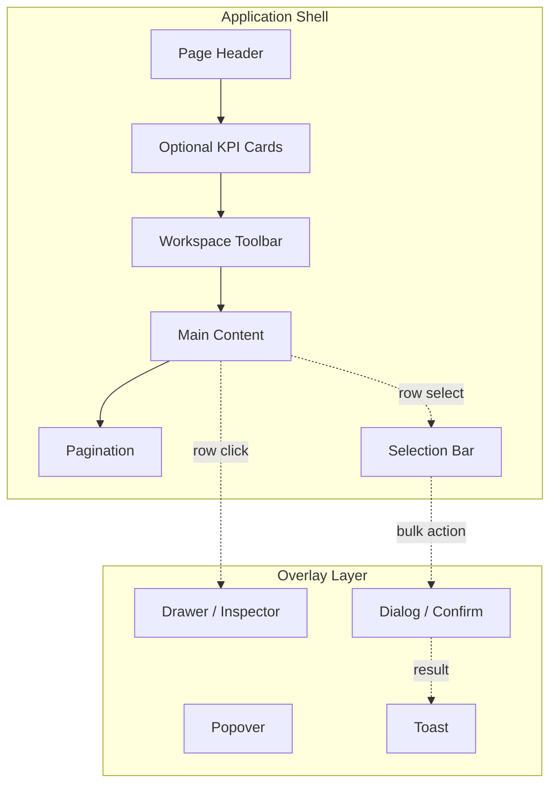
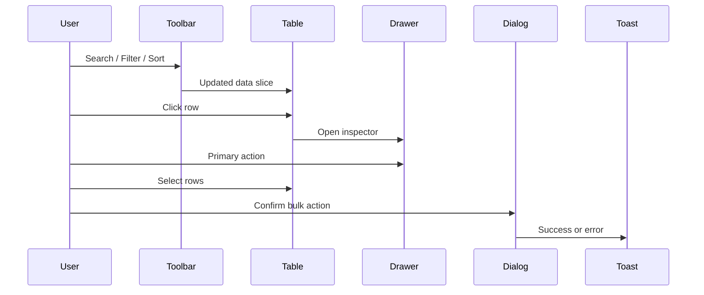

# Workspace Design System

**Document Version:** 1.0  
**Last Updated:** 2026-07-29  
**Status:** Canonical frontend workspace architecture guide

This document defines how every workspace in the AI Affiliate Automation Platform must be designed, structured, and extended. It complements — and does not replace — the existing suite in `/docs` (especially [03-design-system.md](../03-design-system.md), [04-component-library.md](../04-component-library.md), and [02-frontend-architecture.md](../02-frontend-architecture.md)).

---

## 1. Purpose

The platform ships multiple operational workspaces: Dashboard, Discovery, Products, AI Studio, Queue, Channels, and Settings. Without a shared architectural contract, each workspace risks diverging in layout, interaction patterns, component naming, and feedback behavior — producing an application that feels like a collection of pages rather than one product.

This document exists to:

- **Standardize layout hierarchy** so users recognize every screen instantly
- **Unify interaction flows** (search → filter → inspect → act) across domains
- **Govern component reuse** so shared patterns extract once and propagate everywhere
- **Accelerate new workspace development** with templates instead of one-off decisions
- **Enable AI-assisted development** with a single reference that prevents architectural drift

The goal is a **cohesive SaaS experience**: predictable, fast, RTL-native, and drawer-first — regardless of which business domain a workspace serves.

---

## 2. Workspace Philosophy

Every workspace inherits the same design philosophy. These principles are non-negotiable defaults; deviations require explicit documentation and approval.

| Principle | Meaning for workspaces |
| --- | --- |
| **Modern SaaS** | Professional operational UI — not a generic admin template or consumer storefront |
| **Linear / Vercel inspired** | Clear hierarchy, restrained decoration, confident whitespace, subtle elevation |
| **Dark-first** | Both themes must work; dark mode is designed as a first-class experience, not an afterthought |
| **RTL-first** | Arabic is the primary UI language; layout, alignment, and icon placement assume RTL |
| **Minimal visual noise** | No decorative chrome; every element earns its place |
| **Productivity-focused** | Optimize for repeat operators: bulk actions, keyboard paths, fast scanning |
| **Drawer-first interactions** | Inspect and act on entities in context; avoid navigation for detail views |
| **Table-centric workspaces** | List-heavy domains use tables/grids as the primary surface |
| **Progressive disclosure** | Show essentials first; advanced filters, breakdowns, and metadata on demand |
| **Mobile responsive** | Desktop is primary; tablet and mobile remain usable with adaptive toolbars and drawers |
| **Accessibility aware** | Labels, focus, roles, and contrast are built in — not retrofitted |

### How principles compound

```text
Drawer-first  +  Table-centric  →  Row click opens inspector; URL stays stable
Progressive disclosure          →  Popover for score; drawer for entity; dialog for confirm
Productivity-focused            →  Selection bar appears only when rows are selected
Minimal visual noise            →  KPI cards and toolbars use the same border/surface tokens
RTL-first                       →  Action menus, drawer footers, and table alignment mirror correctly
```

A workspace that violates multiple principles (e.g., full-page navigation for row detail, missing empty states, inconsistent toolbar placement) is **not complete** regardless of feature coverage.

---

## 3. Standard Workspace Layout

Every data-heavy workspace follows the same vertical hierarchy. Visual order matches reading order in RTL: header at top, content below, overlays last.

```text
┌─────────────────────────────────────────────────────────────┐
│  Page Header          (title, description, primary actions) │
├─────────────────────────────────────────────────────────────┤
│  Optional KPI Cards   (aggregates, operational snapshot)      │
├─────────────────────────────────────────────────────────────┤
│  Workspace Toolbar    (search, filters, sort, density, …)   │
├─────────────────────────────────────────────────────────────┤
│  Main Content         (table / grid / canvas)               │
├─────────────────────────────────────────────────────────────┤
│  Pagination           (when data set exceeds page size)     │
├─────────────────────────────────────────────────────────────┤
│  Selection Bar        (floating/sticky; visible when selecting)│
└─────────────────────────────────────────────────────────────┘
        │
        ▼  (overlay layer, z-index above content)
   Drawer / Dialog / Popover / Toast
```

### Section responsibilities

| Section | Responsibility | Must not |
| --- | --- | --- |
| **Page Header** | Establish purpose, scope, and workspace-level primary actions | Fetch data; host table controls |
| **KPI Cards** | Summarize counts or health at a glance; optional per workspace | Replace the table; show entity-level detail |
| **Workspace Toolbar** | Search, filter, sort, density, column visibility, refresh, export | Render row data; perform destructive actions without confirm |
| **Main Content** | Primary entity presentation (table, grid, or canvas) | Own server state; call APIs directly |
| **Pagination** | Navigate pages or page-size; reflect server or client slice rules | Hide total count when known |
| **Selection Bar** | Bulk actions for selected rows; selection count | Appear when nothing is selected |
| **Overlays** | Detail (drawer), confirmation (dialog), breakdown (popover), feedback (toast) | Stack drawers; navigate away for inspect |

### Layout variants

Not every workspace uses every section:

| Workspace | KPI | Toolbar | Table | Pagination | Selection | Drawer |
| --- | --- | --- | --- | --- | --- | --- |
| Dashboard | ✅ primary | ⬜ | ⬜ cards | ⬜ | ⬜ | ⬜ |
| Discovery | 🟡 stats | ✅ | ✅ | ✅ | ✅ | ✅ |
| Products | ⬜ | ✅ | ✅ | ✅ | ✅ | ✅ |
| AI Studio | ⬜ | 🟡 config bar | ⬜ canvas | ⬜ | ⬜ | 🟡 dialogs |
| Queue | ✅ | ✅ | ✅ | ✅ | ✅ | ✅ |
| Channels | ⬜ | 🟡 minimal | ✅ | ✅ | ⬜ | ⬜ |
| Settings | ⬜ | ⬜ | ⬜ | ⬜ | ⬜ | ⬜ |

🟡 = partial or domain-adapted implementation today.



---

## 4. Shared Components

Shared components live in `components/layout/`, `components/common/`, and `components/ui/`. Feature workspaces compose them; they do not fork them.

The table below uses **canonical names** (target vocabulary). Current implementations may use feature-local names (e.g., `ProductsToolbar`) that should converge toward these contracts over time.

| Component | Purpose | Use when |
| --- | --- | --- |
| **PageHeader** | Title, description, workspace-level actions | Every workspace page |
| **PageContainer** | Width, padding, responsive gutters | Wraps all page content |
| **WorkspaceStats** | KPI / operational summary cards | Queue, Dashboard, optional Discovery |
| **WorkspaceToolbar** | Domain-specific filters + run actions (e.g., discovery intent) | Discovery filter bar, AI config board |
| **ResultsToolbar** | Search, sort, density, columns, refresh, export, count | Products, Queue, Discovery results |
| **SelectionBar** | Bulk actions + selected count | Any multi-select table workspace |
| **EmptyState** | Zero-data explanation + primary CTA | All list/canvas workspaces |
| **LoadingState** | Skeleton or spinner for initial load | All async workspaces |
| **ErrorState** | Failure message + retry | All async workspaces |
| **ConfirmationDialog** | Destructive or irreversible confirm | Delete, reset, bulk dispatch |
| **Drawer** | Slide-over panel primitive | All inspector patterns |
| **InspectorDrawer** | Entity detail: metadata, previews, primary CTAs | Products, Discovery, Queue |
| **HoverPreview** | Image enlargement on hover/focus | Product thumbnails in tables |
| **ImageThumbnail** | Consistent aspect-ratio product image cell | Tables with visual catalog |
| **StatusBadge** | Backend enum status (product, queue, channel) | Tables, drawers, cards |
| **ScoreBadge** | AI score with quality band | Discovery, Products score columns |
| **PipelineBadge** | Entity progress in publish pipeline | Products inventory, queue readiness |
| **DensitySwitcher** | Comfortable ↔ compact row density | All tables |
| **ColumnVisibility** | Toggle optional table columns | Products, Discovery |
| **Pagination** | Page navigation + page size | Server- or client-paginated tables |
| **ToastOverlay** | Transient success/error feedback | After bulk mutations complete |
| **DataTable** | Shared table shell (header, select, row, actions) | Target extraction from feature tables |
| **Skeleton** | Placeholder shapes during load | Inside LoadingState and table rows |
| **SearchInput** | Debounced or immediate search field | Inside ResultsToolbar |
| **FilterPanel** | Advanced filters (inline bar or drawer) | Discovery advanced filters |
| **ExportMenu** | CSV or file export action | Discovery, Products |

### Popover vs drawer vs dialog

| Pattern | Scope | Example |
| --- | --- | --- |
| **Popover** | Compact secondary detail, non-blocking | AI score breakdown on cell |
| **Drawer** | Full entity inspection + actions | Product details, queue post preview |
| **Dialog** | Short form or confirmation | Schedule publish, delete confirm |

---

## 5. Component Reuse Policy

### Extraction rules

1. **Two-workspace rule** — If two or more workspaces need the same presentation pattern, extract it to `components/common/` (or `components/ui/` if primitive).
2. **Feature logic stays local** — Business rules, API hooks, domain types, and normalization live in `features/<domain>/`.
3. **No premature extraction** — A pattern used once remains in the feature until the second consumer appears.
4. **Presentation is pure** — Shared components receive data and callbacks via props; they never import feature hooks or API modules.
5. **Name by role, not page** — Prefer `SelectionBar` over `ProductsSelectionBar` when behavior is identical.
6. **Extend via composition** — Add slots (`filters`, `actions`, `footer`) instead of forking variants.

### Decision flow

```text
New UI need
    │
    ├─ Exists in components/common or ui? ──→ Reuse
    │
    ├─ Used in 2+ workspaces? ──→ Extract to common
    │
    └─ Domain-specific? ──→ Keep in features/<domain>/components/
```

### Anti-patterns

- Duplicating toolbar markup in three feature folders
- Calling API clients inside `components/common/*`
- Extracting a one-off widget "for future use"
- Embedding queue logic inside a generic `StatusBadge`

---

## 6. Workspace Interaction Model

Every table-centric workspace follows the same user journey. Steps may collapse (e.g., inspect without select) but order and feedback stay predictable.

```text
Search ──→ Filter ──→ Sort ──→ Scan results
                                  │
                                  ├─→ Inspect (row click → Drawer)
                                  │
                                  └─→ Select (checkbox)
                                        │
                                        └─→ Batch Actions (Selection Bar)
                                              │
                                              └─→ Confirm (Dialog, if destructive)
                                                    │
                                                    └─→ Toast Feedback
```

### Interaction rules

| Step | Behavior |
| --- | --- |
| **Search** | Filters visible rows or triggers server query; clear button always available |
| **Filter** | Primary filters in toolbar; advanced filters in drawer or expandable panel |
| **Sort** | Explicit sort control; never hidden implicit sort without indicator |
| **Inspect** | Row body click opens drawer; checkbox and action menu do not trigger inspect |
| **Select** | Shift/multi-select optional future; minimum: single and select-all on page |
| **Batch actions** | Selection bar replaces nothing; floats above or sticks below table |
| **Confirm** | Delete, publish, reset session require dialog |
| **Toast** | Success/error for completed bulk operations; inline alert for persistent form errors |



---

## 7. Tables

Tables are the primary data surface for Discovery, Products, Queue, and Channels. All tables conform to the same standards.

### Structure

| Concern | Standard |
| --- | --- |
| **Column alignment** | Text/start-aligned; numbers and scores/end-aligned with `tabular-nums` |
| **Primary column** | First data column: entity name + thumbnail where applicable |
| **Status columns** | Use `StatusBadge`; exact backend enum strings |
| **Score columns** | Use `ScoreBadge` + popover breakdown |
| **Actions column** | Trailing column; icon menu or buttons; `stopPropagation` on all controls |

### Density modes

| Mode | Row padding | Font | Use case |
| --- | --- | --- | --- |
| **Comfortable** | Generous | Default | Review, inspection workflows |
| **Compact** | Tight | Default or `text-sm` | High-volume scanning |

Density is user-controlled via `DensitySwitcher` and persisted per workspace when practical.

### Behavior

| Behavior | Standard |
| --- | --- |
| **Sticky header** | Header row sticks on vertical scroll within table container |
| **Row hover** | Subtle background change; pointer cursor on clickable rows |
| **Row click** | Opens inspector drawer; not triggered from checkbox or action cells |
| **Bulk selection** | Header checkbox selects visible page; indeterminate when partial |
| **Action menus** | Row-level secondary actions (edit, delete, schedule) |
| **Image previews** | Thumbnail in cell; `HoverPreview` or drawer gallery for detail |
| **Responsive overflow** | Horizontal scroll on narrow viewports; no column drop without toggle |
| **Pagination** | Below table; show range and total when known |
| **Empty state** | Replace table body with `EmptyState` — never blank tbody |
| **Loading** | Skeleton rows matching column layout — never empty flash |

### Selection bar coupling

When `selectedCount > 0`, display `SelectionBar` with:

- Count label (Arabic pluralized)
- Primary bulk action (e.g., publish, import)
- Secondary actions (export, schedule)
- Clear selection control

---

## 8. Drawers

Drawers are the default **inspect-and-act** surface. Full-page routes remain for deep links and shareable URLs, but row interaction should not navigate away.

### When to use a drawer

| Use drawer | Use full page | Use dialog |
| --- | --- | --- |
| Product/post/channel inspect | Shareable bookmark (`/products/[id]`) | Delete confirm |
| Score + metadata review | Multi-section settings | Schedule datetime form |
| Primary CTAs on entity | AI Studio canvas workspace | Reset session |

### Drawer anatomy

```text
┌ Drawer ─────────────────────────────── max-width: md–xl ┐
│ Header: title + close                                    │
├──────────────────────────────────────────────────────────┤
│ Body (scrollable)                                        │
│   • Hero (image / preview)                               │
│   • Key metrics / badges                                 │
│   • Detailed fields                                      │
│   • Progressive sections (collapsible future)            │
├──────────────────────────────────────────────────────────┤
│ Footer: primary + secondary actions (sticky)             │
└──────────────────────────────────────────────────────────┘
```

| Property | Standard |
| --- | --- |
| **Width** | `max-w-md` to `max-w-xl`; advanced filters may be wider |
| **Header** | Entity type label; close button with Arabic `aria-label` |
| **Footer** | Primary action (right in RTL); secondary/cancel adjacent |
| **Scrolling** | Body scrolls; header and footer fixed within drawer |
| **Closing** | Backdrop click, close button, Escape key (target) |
| **Nested dialogs** | Drawer stays open behind confirm dialog; never drawer-on-drawer |

### Drawer content guidelines

- Lead with visual identity (product image, post preview)
- Show pipeline/readiness badges early
- Keep destructive actions in dialog, not drawer footer alone
- Link out to full workspace (e.g., "Open in AI Studio") as secondary action

---

## 9. Toolbars

Toolbars split into two layers: **Workspace Toolbar** (domain intent) and **Results Toolbar** (data manipulation).

### Results Toolbar (standard elements)

| Element | Required | Notes |
| --- | --- | --- |
| Search | 🟡 | Required for inventory/queue; optional for discovery |
| Filters | 🟡 | Status, channel, mode chips |
| Sort | ✅ | Explicit dropdown |
| Density | ✅ | Table workspaces |
| Column visibility | 🟡 | Products, Discovery |
| Refresh | ✅ | Re-fetch server data |
| Export | 🟡 | CSV where supported |
| Result count | ✅ | "عرض X من Y" or equivalent |
| Workspace actions | 🟡 | Domain-specific (run discovery, add channel) |

### Workspace Toolbar (domain elements)

| Workspace | Domain toolbar content |
| --- | --- |
| **Discovery** | Intent tabs, keyword/rating/discount filters, run action |
| **Products** | Status filter (server-side) |
| **Queue** | Status filter, channel filter |
| **AI Studio** | Config control board (type, tone, language, provider) |
| **Channels** | Add channel form trigger |
| **Dashboard** | None (actions in header/cards) |
| **Settings** | Section nav only |

### Adaptive behavior

| Viewport | Adaptation |
| --- | --- |
| **Desktop** | Full toolbar inline |
| **Tablet** | Wrap filters; maintain search width |
| **Mobile** | Collapse filters into drawer; sticky selection bar |

Toolbar never duplicates Page Header title. Header = *what*; Toolbar = *how you slice the data*.

---

## 10. Design Tokens

This section references [03-design-system.md](../03-design-system.md). **Do not redefine colors here.**

### Spacing

- Base unit: **4px**
- Toolbar padding: `p-3` within bordered surface
- Section gaps: `gap-3`–`gap-5` between layout blocks
- Drawer body sections: `space-y-4`–`space-y-5`

### Typography

- Page title: largest semibold in `PageHeader`
- Table headers: `text-xs` uppercase or muted semibold
- Cell body: `text-sm`
- KPI values: `text-xl font-semibold tabular-nums`
- Metadata: `text-xs text-muted-foreground`

### Icons

- Single system: Lucide React
- Icon size in buttons: consistent `size-4` or `size-5`
- Icon-only controls require Arabic `aria-label`

### Badges

- Map to semantic tones: success, warning, error, info, neutral
- Status badges use exact backend enum values
- Score badges include quality band label

### Elevation

- Toolbars and KPI cards: `border` + `bg-surface` (minimal shadow)
- Drawers and dialogs: backdrop + `shadow-xl`
- Toasts: `shadow-xl` + backdrop blur

### Interaction states

- Hover: muted background on rows and icon buttons
- Focus: visible ring (accessibility pass target)
- Disabled: reduced opacity + no pointer
- Loading: button loading prop or skeleton — never freeze UI silently

---

## 11. UX Principles

| Principle | Application |
| --- | --- |
| **Minimize clicks** | Row click → drawer → action in one context |
| **Keep user context** | No full navigation for inspect; preserve scroll and filters |
| **Avoid unnecessary navigation** | Deep links exist but are not the primary path |
| **Prefer inline editing** | Schedule, status toggle in drawer/dialog — not separate page |
| **Batch operations first** | Selection bar for operators managing volume |
| **Fast scanning** | Compact density, aligned numbers, score badges |
| **Consistent feedback** | Toast for mutation result; inline for validation |
| **Predictable interactions** | Same gestures produce same outcomes in every workspace |

### Feedback hierarchy

1. **Inline validation** — form field errors before submit
2. **Inline alert** — persistent fetch failure in workspace
3. **Dialog** — confirm irreversible action
4. **Toast** — transient success/failure after mutation completes

Never use toast alone for errors the user must read and fix (validation).

---

## 12. Workspace Templates

Each workspace implements the standard layout with domain-specific content. Below: purpose, entities, actions, and component mapping.

---

### Dashboard

| Attribute | Value |
| --- | --- |
| **Purpose** | Operational overview and quick entry to workflows |
| **Primary entity** | Aggregates (counts, activity events) |
| **Primary action** | Navigate to workflow (discovery, queue, AI) |
| **Secondary actions** | Refresh dashboard data |
| **Shared components** | PageHeader, PageContainer, Card, EmptyState, LoadingState, ErrorState |
| **Unique components** | Stat cards, activity feed, quick-action cards, system status |

**Layout note:** KPI-forward; no table. Cards replace Main Content.

---

### Discovery

| Attribute | Value |
| --- | --- |
| **Purpose** | Find and evaluate AliExpress products before import |
| **Primary entity** | Discovery product (pre-import) |
| **Primary action** | Run discovery search |
| **Secondary actions** | Import, batch import, export CSV, hand off to AI/queue |
| **Shared components** | PageHeader, ResultsToolbar, SelectionBar, EmptyState, LoadingState, ErrorState, ScoreBadge, Drawer, ToastOverlay (target) |
| **Unique components** | Intent tabs, filter bar, advanced filters drawer, product inspector, discovery stats |

**Layout note:** Workspace Toolbar = intent + filters; Results Toolbar = density, columns, export.

---

### Products

| Attribute | Value |
| --- | --- |
| **Purpose** | Manage imported catalog inventory |
| **Primary entity** | Product (persisted) |
| **Primary action** | Inspect product in drawer |
| **Secondary actions** | Bulk queue, bulk delete (admin), export, AI handoff, status change |
| **Shared components** | PageHeader, ResultsToolbar, SelectionBar, EmptyState, LoadingState, ErrorState, ScoreBadge, PipelineBadge, HoverPreview, Drawer, ConfirmationDialog, ToastOverlay |
| **Unique components** | Product health badges, product actions menu, delete products dialog |

**Layout note:** Server pagination + client search/sort on current page.

---

### AI Studio

| Attribute | Value |
| --- | --- |
| **Purpose** | Generate and refine marketing content |
| **Primary entity** | Content variant (session-scoped) |
| **Primary action** | Generate content |
| **Secondary actions** | Compare variants, copy, add to queue, export |
| **Shared components** | PageHeader, EmptyState, LoadingState, ErrorState, ConfirmationDialog |
| **Unique components** | Config control board, tone matrix, content canvas, variant tabs, distribution hub, suggestions panel |

**Layout note:** Canvas workspace — not table-centric. Toolbar = generation config. Dialogs for compare and reset.

---

### Queue

| Attribute | Value |
| --- | --- |
| **Purpose** | Operate publishing pipeline to Telegram |
| **Primary entity** | Queue item (post) |
| **Primary action** | Publish or schedule |
| **Secondary actions** | Bulk publish, bulk schedule, bulk delete, inspect post |
| **Shared components** | PageHeader, WorkspaceStats, ResultsToolbar, SelectionBar, EmptyState, LoadingState, ErrorState, StatusBadge, PipelineBadge, Drawer, ConfirmationDialog, ToastOverlay |
| **Unique components** | Queue table, scheduling dialog, queue details drawer, queue health badge, actions menu |

**Layout note:** KPI cards required. Client-derived "publishing" and "failed" counts are operational — not backend statuses.

---

### Channels

| Attribute | Value |
| --- | --- |
| **Purpose** | Manage Telegram publishing destinations |
| **Primary entity** | Telegram channel |
| **Primary action** | Register channel |
| **Secondary actions** | Toggle active, view permissions |
| **Shared components** | PageHeader, EmptyState, LoadingState, ErrorState, StatusBadge |
| **Unique components** | Channel list/table, add channel form, permission badges |

**Layout note:** Simpler table; no selection bar today. Inspector may be inline expand or future drawer.

---

### Settings

| Attribute | Value |
| --- | --- |
| **Purpose** | Display capability and readiness information |
| **Primary entity** | Configuration section (read-only) |
| **Primary action** | Navigate sections |
| **Secondary actions** | None (read-only) |
| **Shared components** | PageHeader, PageContainer, Card, Badge, LoadingState, ErrorState |
| **Unique components** | Settings layout, capability view per section |

**Layout note:** No toolbar or table. Section nav + content panels.

---

## 13. Future Workspaces

New workspaces (Campaigns, Analytics, Affiliate Networks, Workspaces, Users, Reports) must adopt this document **before** implementation begins.

### Onboarding checklist for a new workspace

1. Define **primary entity** and **primary action**
2. Choose layout variant (table-centric vs canvas vs read-only)
3. Map sections to standard hierarchy (§3)
4. List shared vs unique components (§4, §12)
5. Document interaction flow (§6)
6. Register API integration in [06-api-integration.md](../06-api-integration.md)
7. Add workspace template section to this document (§12)

### Route and navigation

- One route per workspace under `app/(dashboard)/`
- Sidebar entry with Lucide icon and Arabic label
- PageHeader title matches sidebar label
- Do not invent parallel URL patterns (`/dashboard/foo` vs `/foo`)

### Multi-workspace (SaaS) future

When organization/workspace switching arrives:

- Insert workspace context above Page Header — not inside it
- Filter server queries by workspace ID when backend supports scoping
- Until then, do not render a workspace switcher

---

## 14. Architecture Rules

Mandatory rules for all workspace implementation:

| Rule | Detail |
| --- | --- |
| **No business logic in UI components** | Components render props; hooks own data and mutations |
| **Composition over duplication** | Extend shared toolbars via slots; do not copy-paste |
| **Reuse shared components** | Follow §5 extraction policy |
| **Feature logic stays in features/** | API modules, hooks, types, normalization per domain |
| **TanStack Query for server state** | Lists, details, mutations, cache invalidation |
| **Local state for UI only** | Drawer open, selection, density, dialog visibility |
| **Strict layer separation** | Component → Hook → API module → HTTP client → Backend |
| **No API calls in components** | Including `components/common/*` |
| **Match backend enums exactly** | Status strings, roles, providers |
| **Drawer-first inspect** | Row click opens drawer unless workspace is canvas-type |
| **States are mandatory** | Loading, empty, error on every async view |
| **RTL + dark mode** | Test both on every new workspace |
| **Type-safe contracts** | Feature `types/api.ts` aligned with OpenAPI/Pydantic |

```text
Presentation (components)
        ↑ props
Orchestration (feature view + hooks)
        ↑
API layer (feature *.api.ts)
        ↑
Transport (services/api-client.ts)
```

---

## 15. Success Criteria

A workspace is **complete** when it satisfies all of the following:

### Layout & consistency

- [ ] Uses `PageContainer` + `PageHeader`
- [ ] Follows §3 hierarchy for its variant
- [ ] Toolbar placement matches peer workspaces
- [ ] Overlay layer for drawer/dialog/toast — not inline hacks

### Components

- [ ] Uses shared Empty, Loading, Error states
- [ ] Table workspaces use density control and consistent column rules
- [ ] Selection bar appears for bulk-capable tables
- [ ] Inspector uses Drawer pattern

### Interaction

- [ ] Search → filter → sort → inspect flow works predictably
- [ ] Row click does not conflict with checkbox/actions
- [ ] Destructive actions use ConfirmationDialog
- [ ] Mutations show Toast or inline feedback per §11 hierarchy

### Quality

- [ ] Responsive at mobile, tablet, desktop breakpoints
- [ ] Accessible labels, focus, and roles on interactive controls
- [ ] RTL verified; dark mode verified
- [ ] TypeScript strict; no `any` in feature contracts

### Integration

- [ ] Server state via TanStack Query
- [ ] Documented in [06-api-integration.md](../06-api-integration.md)
- [ ] No mock data paths in production views
- [ ] Admin-only actions gated on role from `/auth/me`

### Documentation

- [ ] Workspace template row in §12 (this document) updated
- [ ] Component registry updated in [04-component-library.md](../04-component-library.md) when shared extracts land

---

## Related Documents

| Document | Relationship |
| --- | --- |
| [03-design-system.md](../03-design-system.md) | Color, type, spacing tokens |
| [04-component-library.md](../04-component-library.md) | Component inventory and status |
| [02-frontend-architecture.md](../02-frontend-architecture.md) | Folder structure and state layers |
| [05-routing-and-navigation.md](../05-routing-and-navigation.md) | Routes and drawer boundaries |
| [06-api-integration.md](../06-api-integration.md) | API contracts per view |
| [07-development-guidelines.md](../07-development-guidelines.md) | Coding standards |
| [09-cursor-prompts.md](../09-cursor-prompts.md) | AI-assisted implementation prompts |

---

*This document is the long-term canonical guide for frontend workspace architecture. Propose amendments via PR with explicit rationale when a workspace requires deviation from these standards.*
